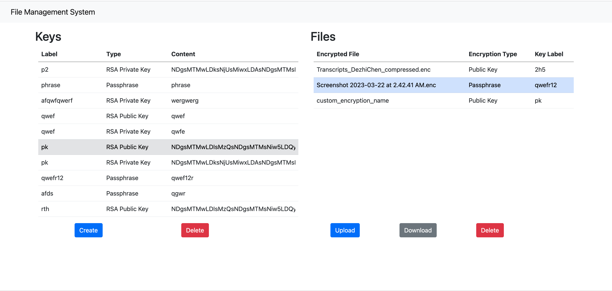
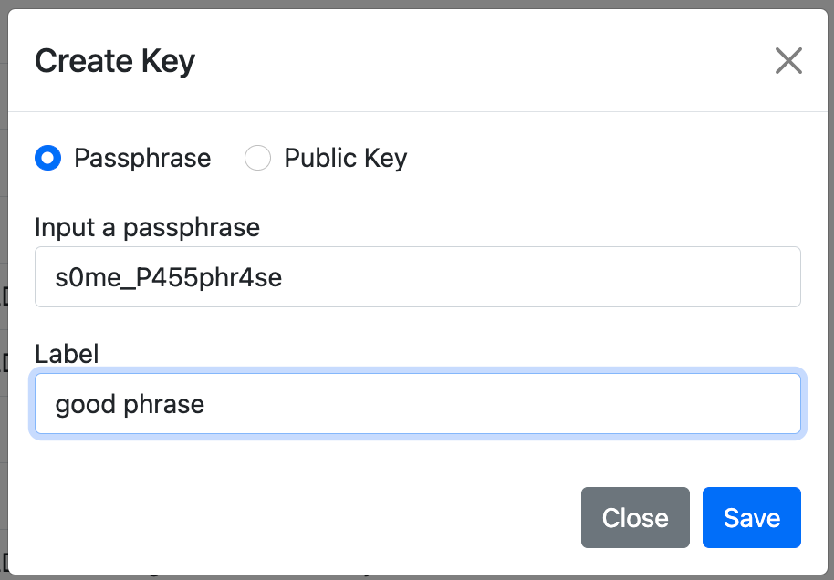
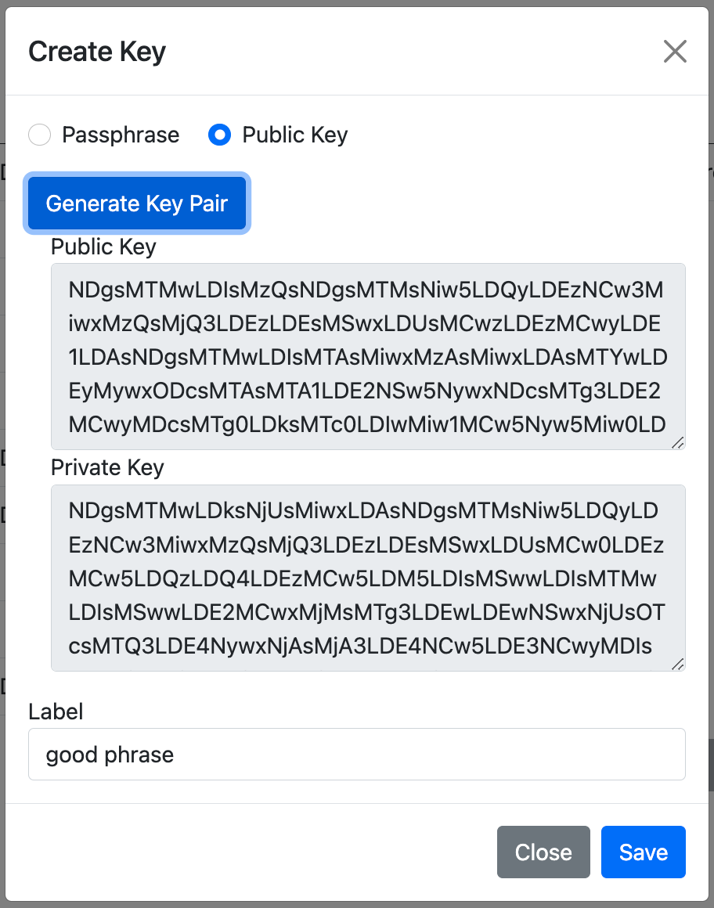
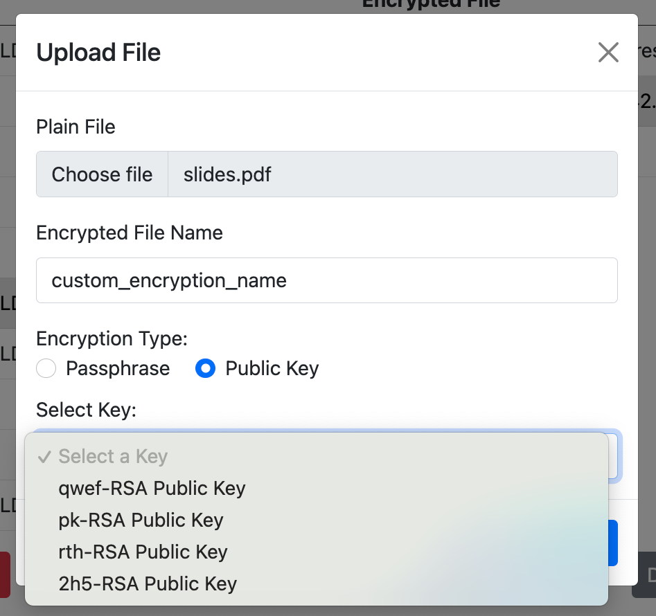
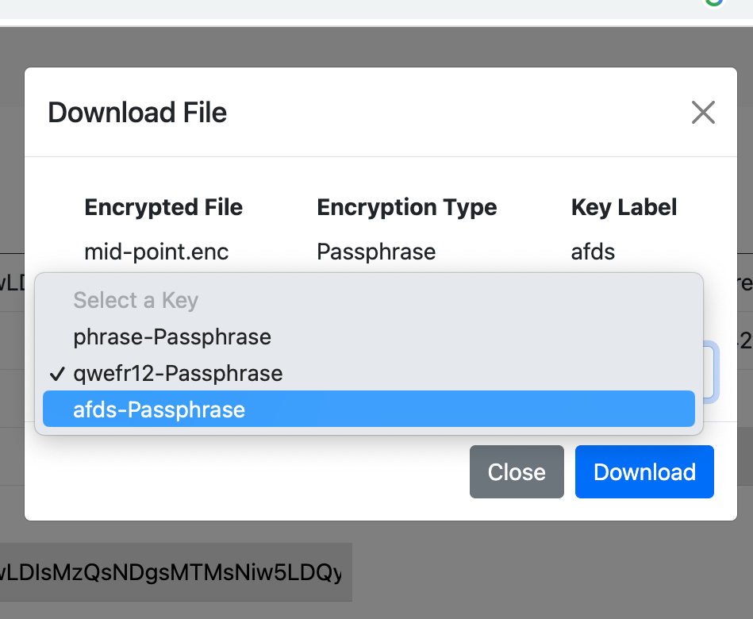
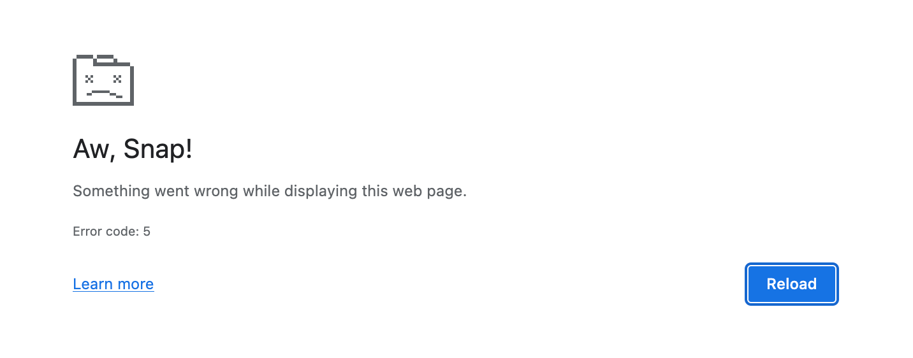

# COMP4127 UG Assignment
___CHEN Dezhi (18250009)___

## User Guide
### Running the Program
_This project uses __Node.js__. Please make sure you have installed it on your machine._

Enter the project root directory and run the following command:
```bash
npm install
npm start
```
Then, open the browser and go to `http://localhost:3000`.

### Using the System
The UI consists of two sections: __Keys__ and __Files__.
There are options to
- Create new keys (passphrase or public key pair)
- Delete existing keys
- Upload files (with encryption)
- Download files (with decryption)
- Delete files



__Create Keys__

Click the _Create_ button to create a new passphrase or public key pair.

For passphrase, you can specify the passphrase in the input box. For public key pair, you can either paste existing keys in the text area, or click the _Generate_ button to generate a new key pair.

<div style="display: flex">
    <div style="margin-right: 5px;"></div>
    <div style="margin-left: 5px;"></div>
</div>


__Upload & Download__

To upload a file,
- choose a file from your local machine,
- edit the encrypted filename if needed,
- choose the encryption type (passphrase or public key),
- select a key from the dropdown list.

To download a file,
- select a file from the list,
- click the _Download_ button,
- choose a key from the dropdown list,
- click _Download_ on the dialog.


<div style="display: flex">
    <div style="margin-right: 5px;"></div>
    <div style="margin-left: 5px;"></div>
</div>


## Which encryption algorithms I used?
__AES-256-CBC__ and __RSA-2048__ are used in this project.

For symmetric passphrase encryption, we used the [_CryptoJS_](https://cryptojs.gitbook.io/docs/) library.
By default, it uses the CBC block mode and PKCS7 padding.
When passing a passphrase to the encryption function, it will generate a 256-bit key.

For asymmetric key encryption, we used a hybrid encryption scheme. Firstly, we generate a random 256-bit AES key to encrypt the file content with AES-256-CBC.
Then we encrypt the AES key with the RSA public key, using
the browser's built-in [_Web Crypto API_](https://developer.mozilla.org/en-US/docs/Web/API/Web_Crypto_API).

## How the keys are generated?

### Passphrase Encryption
In the passphrase encryption mode, the passphrase is specified by the user. Then, this passphrase is passed to CryptoJS and it will generate a 256-bit key for AES encryption.

```javascript
const ciphertext = CryptoJS.AES.encrypt("some plaintext", "s0me_P455phr4se").toString()
```

### Public Key Encryption
I used the _Subtle_ interface of the Web Crypto API to generate a RSA key pair.

```javascript
window.crypto.subtle.generateKey(
    {
        name: "RSA-OAEP",
        modulusLength: 2048,
        publicExponent: new Uint8Array([0x01, 0x00, 0x01]),
        hash: { name: "SHA-256" },
    },
    true,
    ["encrypt", "decrypt"]
)
```

_Please note that this built-in API is only available in secure contexts, i.e. HTTPS or localhost!_

The key contents are stored in the browser's __local storage__ in base64 format, together with a label and its type for identification.

## How the data are handled?
When the user uploads a file, it reads __1)__ the file's metadata, including the _original filename_, size, type and timestamp, and __2)__ the file content, into the browser's memory.

Then, the encryption is performed on the client side by a web worker. The encrypted file content is temporarily stored in the browser's memory as well.

The file metadata and content are encrypted separately. By doing this, later we can firstly only download and try decrypting the small metadata ciphertext to check if the user has chosen the correct key.
If so, we can then download the file content ciphertext and decrypt it.

Furthermore, in public key encryption mode, a random secret AES key is appended to the metadata, and the metadata is encrypted with the RSA public key.
The larger file content is symmetrically encrypted with the AES key.

The encrypted metadata and content are then sent to the server, which will store them in the server's database (sqlite3).

## Limitation
Because we perform the heavy encryption task on the browser, and we used the simple but inefficient Base64 encoding, the system cannot handle large files.

Files less than 10MB should be safe. Larger files may cause the webpage to crash.



This problem could be solved by chunking the file into smaller pieces and processing them one by one.
The same problem and solution also apply to the server side in receiving and sending large data.

However, the developer is really short of time in doing this. So, test it gently with small files, please!
